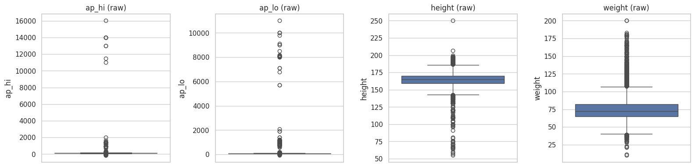
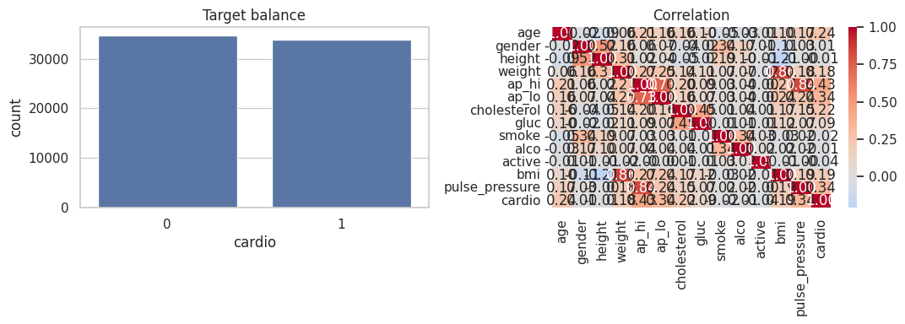
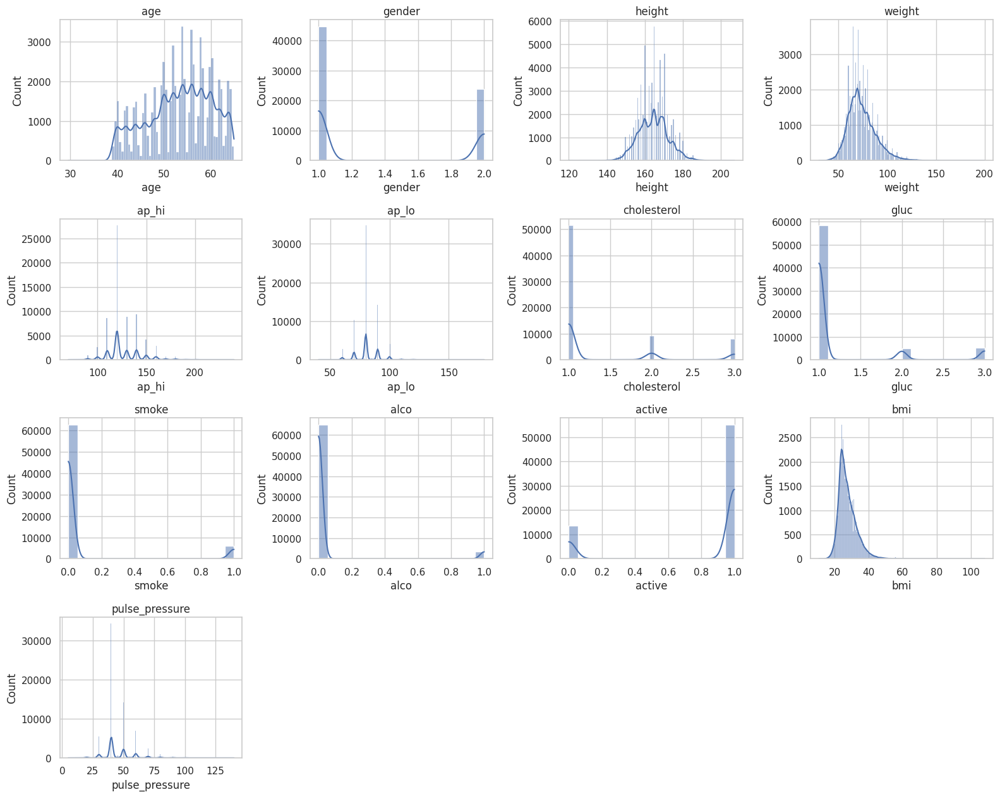
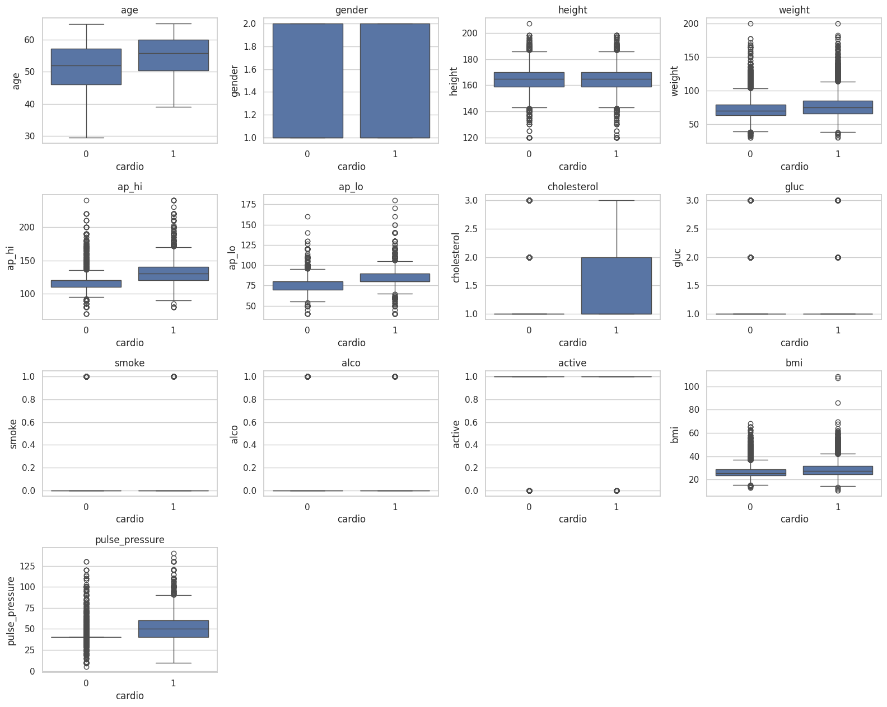
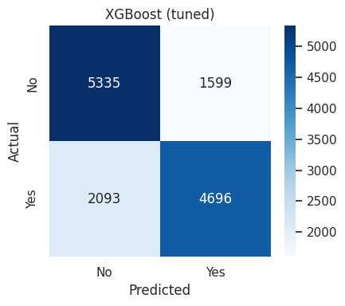
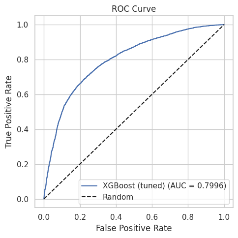
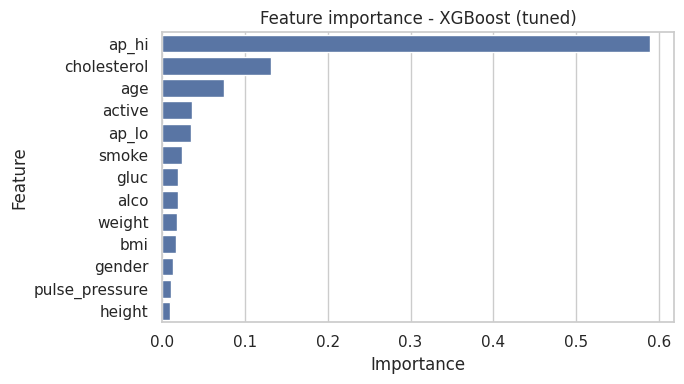
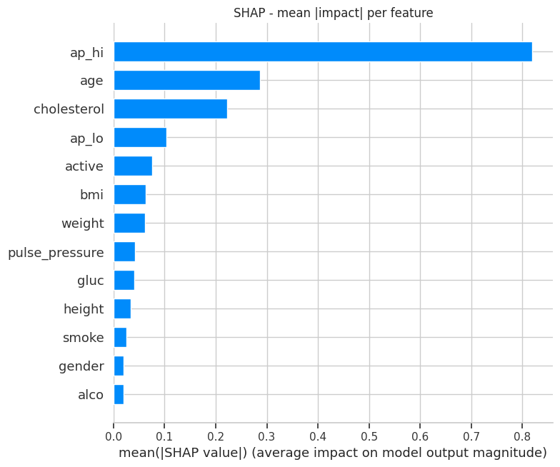
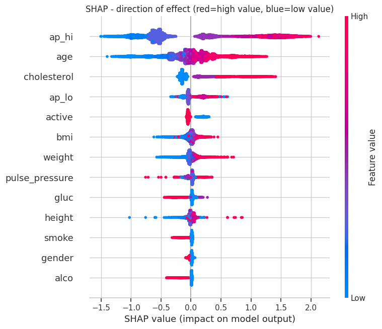

# Cardiovascular Disease Risk Classification

A machine learning project predicting the presence of cardiovascular disease from
routine checkup indicators, to support early risk screening.

## Dataset

[Cardiovascular Disease Dataset (Kaggle)](https://www.kaggle.com/datasets/sulianova/cardiovascular-disease-dataset)
— 70,000 real patient records from routine medical checkups (11 raw features:
age, gender, height, weight, systolic/diastolic blood pressure, cholesterol,
glucose, smoking, alcohol intake, physical activity).

## Objective

Predict presence/absence of cardiovascular disease from routine checkup vitals,
to support early-risk screening and prioritize follow-up care.

## Methodology

1. **Data cleaning** — converted age from days to years; removed physiologically
   implausible blood pressure, height, and weight values (2.0% of rows).
2. **Feature engineering** — added BMI and pulse pressure (systolic − diastolic),
   both standard, clinically meaningful derived features for this dataset.
3. **Duplicate/leakage check** — verified duplicate rate before modeling (1.0%)
   and re-confirmed with a de-duplicated sensitivity check after training.
4. **EDA** — target balance, feature distributions, feature-vs-target boxplots,
   correlation heatmap.
5. **Statistical validation** — Mann-Whitney U test with rank-biserial effect
   size for every feature against the target.
6. **Modeling** — Logistic Regression, Decision Tree, Random Forest, KNN, and
   XGBoost compared under 5-fold stratified cross-validation on the training
   set only; top 2 models tuned via RandomizedSearchCV; single final
   evaluation on a held-out test set.
7. **Explainability** — feature importance and SHAP (global + directional).
8. **Threshold tuning** — evaluated the default, best-F1, and a
   recall-targeted decision threshold, since a missed at-risk case is more
   costly than an unnecessary follow-up.

## Data Cleaning

Raw blood pressure, height, and weight values were checked for physiological
plausibility before any modeling decision was made.

<p align="center">
  
</p>
<p align="center"><em>Raw BP/height/weight distributions before outlier filtering — the basis for the cleaning bounds used.</em></p>

## Exploratory Data Analysis

<p align="center">
  
</p>
<p align="center"><em>Target class balance (50.5% / 49.5% — no imbalance handling required) and feature correlation heatmap.</em></p>

<p align="center">
  
</p>
<p align="center"><em>Distribution of every feature after cleaning and feature engineering.</em></p>

<p align="center">
  
</p>
<p align="center"><em>Each feature split by target class — the view that shows which features actually separate the classes.</em></p>

## Model Evaluation

<p align="center">
  
</p>
<p align="center"><em>Confusion matrix for the final selected model (XGBoost, tuned) on the held-out test set.</em></p>

<p align="center">
  
</p>
<p align="center"><em>ROC curve — AUC 0.7996 against the random-guess diagonal.</em></p>

## Explainability

<p align="center">
  
</p>
<p align="center"><em>Feature importance from the final XGBoost model.</em></p>

<p align="center">
  
</p>
<p align="center"><em>SHAP — mean absolute impact per feature.</em></p>

<p align="center">
  
</p>
<p align="center"><em>SHAP — direction of effect per feature (red = high value, blue = low value).</em></p>

## Results

| Metric | Score |
|---|---|
| **Model** | XGBoost (tuned) |
| Test Accuracy | 73.10% |
| Test Precision | 74.60% |
| Test Recall | 69.17% |
| Test F1 | 0.7178 |
| Test ROC-AUC | 0.7996 |
| Train–test F1 gap | +0.95% (no overfitting) |

**Model comparison (5-fold CV, training data only):**

| Model | CV F1 | ROC-AUC |
|---|---|---|
| XGBoost (tuned) | 0.7214 | — |
| XGBoost | 0.7169 | 0.7983 |
| Logistic Regression (tuned) | 0.7095 | — |
| Logistic Regression | 0.7095 | 0.7916 |
| Decision Tree | 0.7079 | 0.7788 |
| KNN | 0.7077 | 0.7788 |
| Random Forest | 0.7058 | 0.7728 |

**Threshold trade-off:** shifting the decision threshold from 0.50 to 0.278
raises recall from 69.2% to 90.0% (catching far more real at-risk patients)
at the cost of precision dropping from 74.6% to 61.1% — a deliberate,
documented trade-off given the clinical asymmetry between the two error
types (a missed risk case is costlier than an unnecessary follow-up).

**Duplicate sensitivity check:** only 1.0% of rows (674 of 68,614) were exact
duplicates; re-training on de-duplicated data changed test F1 by just 0.0003
(0.7178 → 0.7175), confirming the headline result is not inflated by
memorization.

## Key Findings

- Systolic blood pressure, pulse pressure, and cholesterol were the strongest
  predictors of cardiovascular disease risk.
- SHAP confirms the direction of effect is consistent with known clinical
  associations (higher BP/cholesterol → higher predicted risk).

## Business Interpretation

This model is a decision-support tool, not a diagnostic system. It can help
prioritize which patients receive closer monitoring or follow-up testing
based on routine checkup data alone, without requiring specialist review at
the screening stage.

## Limitations

- Trained on one dataset from routine checkups; not externally validated.
- Predicts statistical association between checkup indicators and the
  disease label, not a clinical diagnosis or causal relationship.
- Should not replace clinical judgment or diagnostic testing.

## Repository Structure

```
cardiovascular-disease-risk-classification/
├── data/                    # not committed (see .gitignore)
├── notebook/
│   └── Cardiovascular_Disease_Classification.ipynb
├── screenshots/
│   └── (README figures — EDA, confusion matrix, ROC, feature importance, SHAP)
├── model/
│   └── cardio_final_model.pkl
├── requirements.txt
└── README.md
```

## How to Run

1. Download the dataset from Kaggle.
2. Open `notebook/Cardiovascular_Disease_Classification.ipynb` in Google Colab.
3. Run all cells; upload the CSV when prompted.

## Technologies Used

Python · pandas · NumPy · scikit-learn · XGBoost · SHAP · SciPy ·
Matplotlib · Seaborn

## Author

Rajveer Singh
